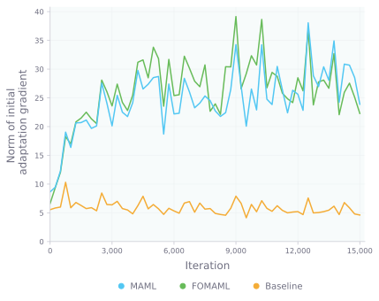
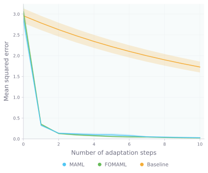
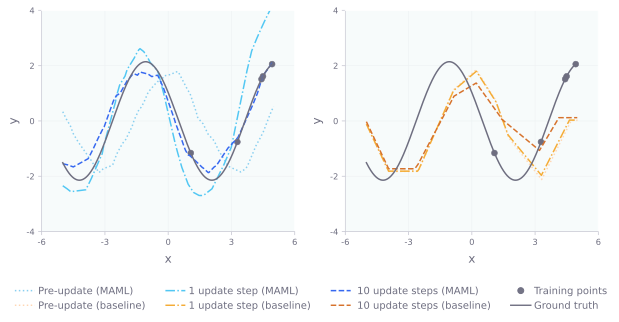

# learning-to-learn

Implementing and exploring MAML, FOMAML, and direct pre-training on sinusoid regression tasks.

## Background
Model Agnostic Meta-Learning ([Finn et al., 2017](https://arxiv.org/abs/1703.03400)) is an algorithm that enables a model to leverage its prior experience in solving various tasks to then learn new tasks much more efficiently compared to otherwise learning from scratch. MAML does so by formulating meta-learning as a bi-level optimization problem, where the inner-level adapts to a new task and the outer-level performs a meta-update on the model's parameters. In this way, MAML learns a set of initial parameters for rapid finetuning:

  

The crux of MAML lies on Line 10; since the meta-gradient is computed with respect to the outer parameters *θ*, and not with respect to the inner adapted parameters *θi(K)*, this entails backpropagating through the *dynamics* of the *K* steps of gradient descent. Since evaluating this term requires taking expensive higher-order derivatives, first-order MAML ([Nichol et al., 2018](https://arxiv.org/abs/1803.02999)) simplifies the computation by only considering first-order contributions.

## Experiment

MAML and FOMAML are evaluated on the sinusoid regression problem from [Finn et al., 2017](https://arxiv.org/abs/1703.03400) and compared to a baseline of joint pre-training on all meta-training tasks. For consistency, model architectures and hyperparameter values are the same as those in [Finn et al., 2017](https://arxiv.org/abs/1703.03400).

## Results
The figure below on the left shows the Frobenius norm of the initial adaptation gradient throughout meta-training. This metric quantifies the adaptability of the model parameters, and notably, its value increases over time in both MAML (blue) and FOMAML (green). These results support the claim that "[MAML] can be viewed as maximizing the sensitivity of the loss functions of new tasks with respect to the parameters" ([Finn et al., 2017](https://arxiv.org/abs/1703.03400)). As such, MAML and FOMAML are able to "learn how to learn" through meta-training and achieve low error using fewer than 10 adaptation steps when meta-testing. A direct pre-training approach (orange) fails because a given input corresponds to many different outputs across the meta-training tasks.

<table align="center">
  <tr>
    <td></td>
    <td></td>
   </tr> 
</table>

The plot below qualitatively contrasts MAML and the pre-training baseline. Even when all inputs lie on the same half of the *x*-axis, MAML is still able to recover the ground truth function in 10 updates, whereas the pre-training approach struggles.

  

## References

- [Model-Agnostic Meta-Learning for Fast Adaptation of Deep Networks (Finn et al., 2017)](https://arxiv.org/abs/1703.03400).
- [On First-Order Meta-Learning Algorithms (Nichol et al., 2018)](https://arxiv.org/abs/1703.03400).
- Code structure adapted from [Stanford's CS330: Deep Multi-Task and Meta Learning](https://cs330.stanford.edu/), taught by Prof. Chelsea Finn.